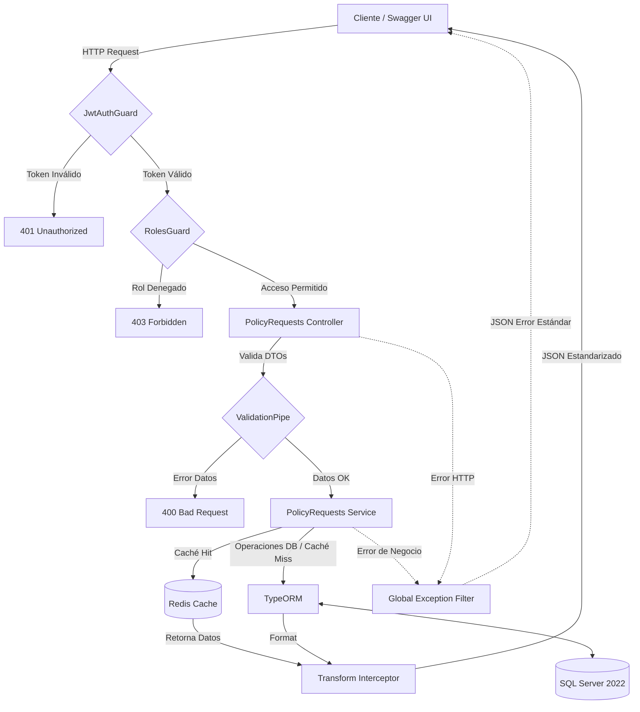

# Backend de Gestión de Solicitudes de Pólizas de Seguro

**Candidato:** Derek Cabrera

**Tecnologías:** NestJS, Node.js, TypeScript, SQL Server, Redis.

Este proyecto constituye la resolución de la prueba técnica para el cargo de Desarrollador Backend. Se trata de un servicio RESTful diseñado para gestionar el ciclo de vida de solicitudes de emisión de pólizas, integrando persistencia en base de datos relacional, mecanismos de seguridad mediante JWT y optimización de rendimiento a través de capas de caché.

## Requisitos de Entorno

Para asegurar la correcta ejecución del sistema, se requiere contar con los siguientes componentes instalados:

- Node.js (Versión 18.x o superior)
    
- Docker y Docker Compose
    
- Gestor de paquetes npm
    

## Configuración e Instalación

1. **Clonación del Repositorio**
    
    Bash
    
    ```
    git clone https://github.com/DexBuilds/insurance-policy-backend.git
    cd insurance-policy-backend
    ```
    
2. **Instalación de Dependencias**
    
    Bash
    
    ```
    npm install
    ```
    
3. **Variables de Entorno** Debe crearse un archivo `.env` en el directorio raíz con la siguiente configuración:
    
    Fragmento de código
    
    ```
    DB_PORT=1433
    DB_USERNAME=sa
    DB_PASSWORD=Contraseña123@
    DB_DATABASE=master

    JWT_SECRET=Secreto123@

    REDIS_HOST=localhost
    REDIS_PORT=6379
    ```
    

## Ejecución del Sistema

El despliegue de la infraestructura se gestiona mediante contenedores para garantizar la paridad de entornos.

1. **Levantamiento de Infraestructura**
    
    Bash
    
    ```
    docker-compose up -d
    ```
    
    _Nota: Este comando inicializa las instancias de SQL Server 2022 y Redis._
    
2. **Inicio de la Aplicación**
    
    Bash
    
    ```
    npm run start:dev
    ```
    
    La interfaz de la API estará disponible en `http://localhost:3000`.
    

## Documentación Técnica (OpenAPI / Swagger)

La definición completa de los contratos de la API, esquemas de datos y códigos de respuesta se encuentra disponible de manera interactiva. Acceso: **[http://localhost:3000/api/docs](https://www.google.com/search?q=http://localhost:3000/api/docs)**

## Ciclo de Pruebas

Se han implementado pruebas automatizadas para asegurar la integridad de las reglas de negocio y la estabilidad de los endpoints, aislando el código mediante técnicas avanzadas de simulación.

- **Pruebas Unitarias:** Validan la lógica de servicios y transiciones de estado. Se implementaron **mocks de repositorios (TypeORM)** para garantizar que la capa de negocio se evalúe de forma completamente independiente a la base de datos.
 ```bash
 npm run test
 ```

- **Pruebas de Integración (E2E):** Simulan flujos completos de peticiones HTTP, validación de DTOs y control de acceso. Se configuró un entorno de pruebas aislado haciendo **mock del sistema de caché (Redis), la capa de persistencia y los Guards de autenticación (JWT)**. Esto permite una ejecución determinista y de latencia ultrabaja (milisegundos) sin depender de la infraestructura externa de contenedores.
``` Bash
npm run test:e2e
```

## Decisiones de Arquitectura y Diseño

- **Patrón Modular:** La aplicación se organiza en módulos independientes (`auth`, `policy-requests`, `database`), facilitando el mantenimiento y la escalabilidad horizontal del código.
    
- **Manejo de Errores Centralizado:** Se ha implementado un `GlobalExceptionFilter` que intercepta todas las excepciones del sistema para devolver una respuesta estandarizada. Esto asegura que el cliente siempre reciba una estructura predecible ante errores de validación o fallos internos.
    
- **Optimización de Lectura:** El endpoint de consulta de solicitudes integra un interceptor de caché sobre Redis. Esta estrategia reduce la latencia en operaciones de alta frecuencia y minimiza la carga transaccional sobre el servidor SQL.
    
- **Seguridad y Control de Acceso:** Se implementó una arquitectura de seguridad basada en Claims dentro de los tokens JWT. El acceso a la actualización de estados críticos está restringido mediante un `RolesGuard`, permitiendo únicamente la ejecución a usuarios con roles de administrador o supervisor.
	
- - **Estandarización de Respuestas:** A través de un `TransformInterceptor`, todas las respuestas exitosas de la API son envueltas en un formato unificado (`success`, `data`, `timestamp`), manteniendo total coherencia con el manejo global de excepciones.
	
- **Trazabilidad y Monitoreo (Logs):** Se integró un `LoggerMiddleware` global que registra las peticiones HTTP entrantes (método, ruta, status code, IP), facilitando la auditoría y el debugging en entornos de desarrollo y producción.


### Diagrama de Arquitectura de Alto Nivel

El siguiente diagrama ilustra el flujo de las peticiones a través de las distintas capas de la aplicación:



